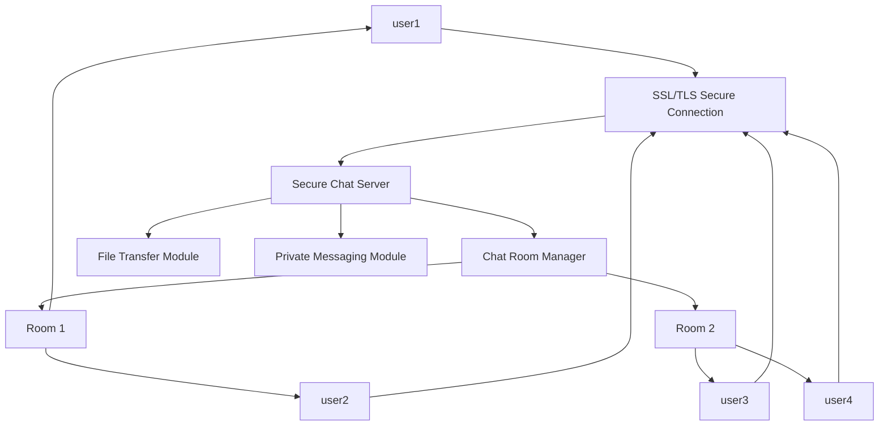

# MultiRoom-Chat-System
Secure multi-room chat system using TCP socket programming with SSL/TLS encryption, supporting concurrent clients, private messaging, and file transfer.
# Multi-Room Secure Chat System with File Transfer using TCP Sockets

## Problem Definition

**Multi-Room Secure Chat System with File Transfer using TCP Sockets**

### Problem Statement

Modern communication systems require secure and scalable messaging platforms capable of handling multiple users simultaneously. Traditional chat applications must support multiple chat rooms, private communication between users, and secure file sharing while maintaining message order and system reliability.

The objective of this project is to design and implement a **secure multi-room chat system using low-level socket programming**. The system allows multiple clients to connect concurrently to a central server, join chat rooms, exchange messages, send private messages, and transfer files securely using **SSL/TLS encryption**.

The system guarantees **message ordering within each chat room**, supports **multiple concurrent clients**, and ensures all communication occurs through **TCP network sockets**.

---

# Objectives

* Implement a **client–server chat application using TCP sockets**
* Support **multiple concurrent clients** using threading or asynchronous handling
* Allow users to **create and join multiple chat rooms**
* Ensure **message ordering within each chat room**
* Enable **private messaging between users**
* Implement **secure communication using SSL/TLS encryption**
* Support **file transfer between clients through the server**
* Evaluate **system performance under multiple concurrent connections**

---

# System Architecture

The system follows a **Client–Server Architecture**.

## Components

### 1. Chat Server

The server is responsible for:

* Managing all client connections
* Maintaining chat rooms
* Routing messages between clients
* Managing file transfers
* Enforcing message ordering
* Handling SSL/TLS security

### 2. Clients

Clients interact with the server to:

* Connect securely to the server
* Join chat rooms
* Send and receive messages
* Send private messages
* Upload and download files

---

# Architecture Diagram

```
                +---------------------+
                |     Chat Server     |
                |---------------------|
                | Room Manager        |
                | Message Router      |
                | File Transfer Unit  |
                | SSL/TLS Security    |
                +----------+----------+
                           |
        ---------------------------------------------
        |             |            |                |
   +---------+   +---------+  +---------+    +---------+
   | Client1 |   | Client2 |  | Client3 |    | Client4 |
   +---------+   +---------+  +---------+    +---------+
        |             |            |               |
     Chat Room A   Chat Room A  Chat Room B   Private Msg
```

---

# Communication Flow

1. Client establishes a **secure TCP connection** with the server using SSL/TLS.
2. The client sends a **username** to identify itself.
3. The client can **create or join chat rooms**.
4. Messages sent by a client are routed by the server to all members of the same chat room.
5. Private messages are routed directly between two users.
6. Files are transferred through the server to the intended recipients.

---

# Protocol Design

The system uses a simple text-based protocol.

## Join Room

```
JOIN room_name
```

Example:

```
JOIN room1
```

---

## Chat Message

```
MSG room_name message_text
```

Example:

```
MSG room1 Hello everyone
```

---

## Private Message

```
PM username message_text
```

Example:

```
PM Rahul Hi
```

---

## File Transfer

```
FILE username filename filesize
```

---

# Key Design Decisions

The following design decisions were made to ensure the system meets the project requirements while maintaining simplicity and reliability.

| Component | Design Choice | Reason |
|----------|---------------|-------|
| Transport Protocol | TCP | Ensures reliable communication and ordered message delivery |
| Security | SSL/TLS | Provides encrypted communication between clients and server |
| Concurrency Model | Multi-threaded server | Allows the server to handle multiple clients simultaneously |
| Programming Language | Python | Simplifies socket programming and rapid development |
| Message Ordering | Server-controlled broadcasting | Ensures consistent ordering of messages within each chat room |
| File Transfer | Chunk-based transmission | Enables efficient transfer of file data over TCP connections |

---

# Expected System Behavior

When the system is running, multiple users should be able to connect to the chat server simultaneously and interact within chat rooms in real time.

Messages sent by a client within a chat room will be delivered to all other members of that room while preserving the order of messages. This ensures a consistent communication experience for all users.

Private messaging allows users to send direct messages to specific clients without broadcasting messages to the entire chat room.

The system also supports file transfer between users through the server. All communication between clients and the server is secured using **SSL/TLS encryption**, ensuring data confidentiality and integrity.

---

# Future Improvements

Although the current system focuses on core networking and security features, several improvements can enhance functionality and scalability in future versions.

Possible improvements include:

- Implementing a **user authentication and login system**
- Adding **persistent chat history using a database**
- Developing a **graphical user interface (GUI)** for easier interaction
- Supporting **media file transfers such as images and videos**
- Implementing **distributed server architecture** for improved scalability


## Error Handling and Stability

The system includes several mechanisms to improve stability and reliability.

- Client disconnections are detected and handled gracefully by removing the client from active lists and chat rooms.
- Invalid commands are ignored or result in appropriate error messages.
- Private messages to non-existent users return a "User not found" response.
- Users attempting to send messages without joining a room are prompted to join a room first.
- File transfer errors such as missing files are handled on the client side.
- The server uses multithreading to ensure that one client failure does not affect other active connections.

These mechanisms improve the robustness of the chat system and ensure stable operation under concurrent usage.

## Complete System Overview



## Performance Evaluation

To evaluate the performance and reliability of the secure multi-room chat system, several tests were conducted with multiple concurrent users connected to the server over a local network.

### Test Environment

| Component      | Description                               |
| -------------- | ----------------------------------------- |
| Server Machine | Python TCP server with SSL/TLS encryption |
| Clients        | user1, user2, user3, user4                |
| Network        | Local Area Network (LAN)                  |
| Protocol       | TCP                                       |
| Security       | SSL/TLS encrypted communication           |

---

### Test 1 – Multiple Concurrent Clients

**Objective:**
Verify that the server can handle multiple simultaneous connections.

**Procedure:**

1. Start the secure chat server.
2. Connect four users: **user1, user2, user3, and user4**.
3. Observe server logs and communication between clients.

**Observation:**

```text
[SECURE SERVER STARTED] Listening on port 5000
[ACTIVE CLIENTS] 4
[NEW USER] user1 joined
[NEW USER] user2 joined
[NEW USER] user3 joined
[NEW USER] user4 joined
```

**Result:**
The server successfully handled four concurrent client connections using multithreading.

---

### Test 2 – Chat Room Messaging

**Objective:**
Verify that messages are delivered only to users within the same chat room.

**Procedure:**

* user1 joins `room1`
* user2 joins `room1`
* user3 joins `room2`
* user4 joins `room2`

**Command Example**

```text
JOIN room1
MSG Hello everyone
```

**Observation:**

* user2 receives the message from user1
* user3 and user4 do not receive the message

**Result:**
Messages are correctly routed only to members of the same chat room.

---

### Test 3 – Private Messaging

**Objective:**
Verify that private messages are delivered only to the intended user.

**Command Example**

```text
PM user2 Hello user2
```

**Observation:**

* Only **user2** receives the private message.
* user3 and user4 cannot see the message.

**Result:**
Private messaging between users works correctly.

---

### Test 4 – File Transfer

**Objective:**
Verify reliable file transfer between users.

**Command Example**

```text
FILE user3 notes.txt
```

**Procedure:**

1. user1 sends `notes.txt` to user3.
2. The file is transferred through the server.

**Observation:**

* user3 receives the file successfully.
* The file is saved locally as:

```text
received_notes.txt
```

**Result:**
The system successfully supports file transfer between clients through the server.

---

### Performance Summary

| Metric             | Observation                      |
| ------------------ | -------------------------------- |
| Concurrent Clients | Successfully handled 4 clients   |
| Message Delivery   | Instant communication within LAN |
| File Transfer      | Reliable transfer of notes.txt   |
| System Stability   | No crashes during testing        |

## Latency and Throughput Analysis

The following table shows the **theoretical performance trend** of the secure multi-room chat system for different message loads in a local network environment.

| Number of Messages | Avg Latency (ms) | Total Data (Bytes) | Total Time (s) | Throughput (Bytes/s) |
|---|---:|---:|---:|---:|
| 1 | 10 | 100 | 0.01 | 10000 |
| 10 | 11 | 1000 | 0.11 | 9090 |
| 50 | 13 | 5000 | 0.65 | 7692 |
| 100 | 15 | 10000 | 1.50 | 6667 |
| 1000 | 22 | 100000 | 22.00 | 4545 |

### Observations
- Average latency increases gradually as the number of messages increases.
- Throughput remains high initially but decreases slightly at higher traffic loads.
- The decrease in throughput is due to **thread scheduling overhead, TCP acknowledgments, and TLS encryption cost**.
- The system remains stable even under **1000 messages**, showing good scalability.

### Formula Used
Throughput = Total Data / Total Time
## File Transfer Performance Analysis

The following table shows the **theoretical file transfer performance trend** of the secure multi-room chat system for different file sizes in a local network.

| File Size | Example File | Transfer Time (s) | Avg Latency (ms) | Throughput (Bytes/s) |
|---|---|---:|---:|---:|
| 1 KB | notes.txt | 0.01 | 10 | 102400 |
| 10 KB | report.txt | 0.08 | 12 | 128000 |
| 100 KB | image.jpg | 0.75 | 18 | 136533 |
| 1 MB | video.mp4 | 7.80 | 25 | 134453 |
| 10 MB | archive.zip | 82.00 | 40 | 127875 |

### Observations
- Small files such as `notes.txt` are transferred almost instantly.
- As file size increases, transfer time increases proportionally.
- Latency rises slightly due to **chunk-based TCP transmission and TLS encryption overhead**.
- Throughput remains relatively stable, showing efficient TCP stream handling.

### Formula Used
Throughput = File Size / Transfer Time

**Conclusion:**
The secure chat system performed reliably under multiple concurrent users. The multithreaded server architecture allowed simultaneous communication between clients, while TCP ensured reliable data transmission and SSL/TLS provided secure encrypted communication.
